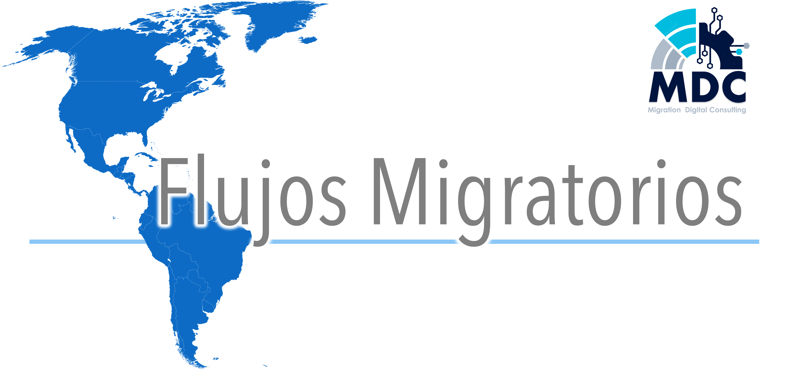

   
   

## Introducción
Las tendencias migratorias en el hemisferio occidental han cambiado significativamente en la última década. La movilidad humana ha aumentado en los últimos años en toda América Latina y la migración intrarregional también ha sido una tendencia común, México y los países de América central y del sur han servido tanto como emisores, receptores como de tránsito.

Estados Unidos es el país con los valores más altos de migrantes a nivel mundial. Datos del año 2020 describen que 50,6 millones (15,3%) de la población de Estados Unidos corresponde a migrantes. En el año 2021, el 80% de las personas migrantes que llegaron a la frontera entre Estados Unidos y México eran provenientes de los países: México, Guatemala, El Salvador y Honduras. En contraste sólo 3 millones de la población corresponde a emigrantes de Estados Unidos, superando ampliamente por la migración que llega al país.

Esto puede estar siendo provocado por diversos factores políticos, sociales y culturales, entre los cuales mencionamos las remesas, que corresponde a las transferencias de dinero, en este contexto de un país a otro. Mientras que Estados Unidos recibe un 0% del PIB en remesas, México recibe un 4.2% del producto interno bruto de éstas. Esto refleja la importancia de las remesas en la economía global y se estima que tan sólo en el año 2020 se enviaron cerca de 540.000 millones de dólares en remesas en todo el mundo, según datos del Banco Mundial. Las remesas pueden tener un impacto significativo en la economía de los países receptores y pueden ser una fuente importante de ingresos para muchas familias en todo el mundo.

### Objetivos
Nuestros objetivos para afrontar la situación anteriormente planteada son:
1. Analizar a los migrantes en Estados Unidos y Latinoamérica para identificar patrones y tendencias de migración.
2. Identificar las principales razones por las cuales las personas migran de un país a otro.
3. Analizar la situación económica de los migrantes para comprender como la migración afecta la economía del país de origen y destino.
4. Comparar el índice de felicidad de los diferentes países de Latinoamérica con el índice de felicidad de Estados Unidos.

## Desarrollo 
En nuestro repositorio encontraras el desarrollo de las actividades realizadas semana a semana. A continuación un breve resumen de lo que encontraras en ellas:
+ **Semana 1:** 
+ **Semana 2:** [Data Engineering](https://github.com/Hamil32/PF-Migracion/blob/main/Semana%202)
+ **Semana 3:** [Data Analytics](https://github.com/Hamil32/PF-Migracion/tree/main/Semana%203/Data%20Analytics) y [Modelo de Machine Learning](https://github.com/Hamil32/PF-Migracion/tree/main/Semana%203/ML)

   - [Visualización del Análisis de Datos](https://app.powerbi.com/reportEmbed?reportId=581a568a-031e-4a5f-ac3b-855c0745e528&autoAuth=true&ctid=c9553b71-e9f5-4264-9080-f30bc2ddf506)
   - [Disponibilización de Modelo de Machine Learning](https://gvbrilo-streamlit-app--principal-72ejtx.streamlit.app/)

## Equipo de trabajo
**Migration Digital Consulting** somos un equipo multidisciplinario conformado por:

|[Hamil Flores](https://www.linkedin.com/in/hamil-balverdi/)  | [Ricardo Lopera](https://www.linkedin.com/in/ricardo-lopera-márquez-839602276/) | [Carolina Hernández](https://www.linkedin.com/in/carolinahernandezbarra/)  | [Lorenzo Prado](https://github.com/gvbrilo)  |
|---|---|---|---|
|_Data Analyst_|_Data Engineer_  |_Analista Funcional_|_Machine Learning_|

## Stack tecnológico:

   
   
   

   
