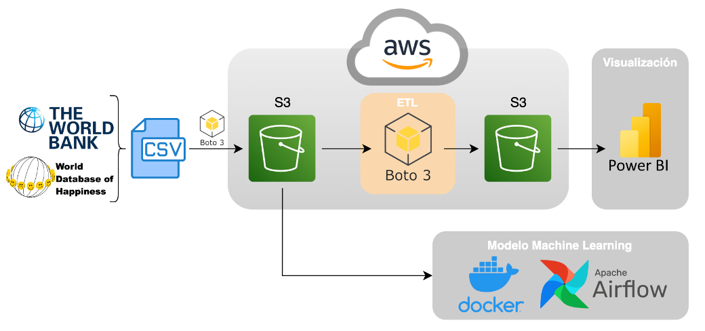
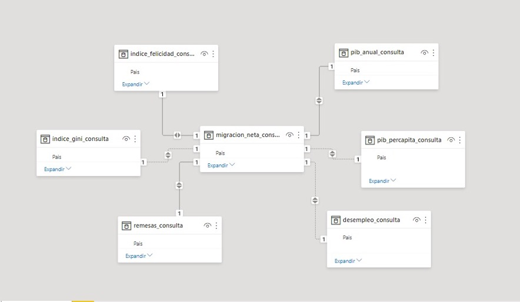
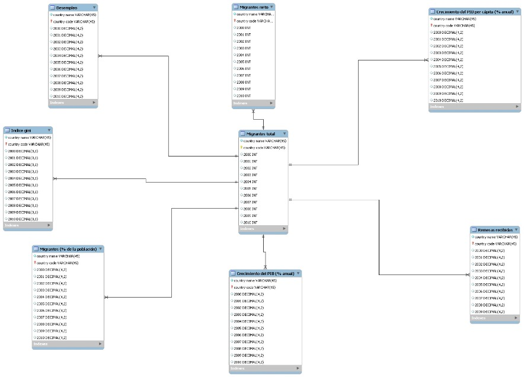

# <h1 align="center"> Data engineering </h1>

## Tabla de contenidos
* [Introducción](##Introducción)
* [Tecnologías a usar](##Tecnologías-a-usar)
* [Flujo de trabajo](##Flujo-de-trabajo)
* [Modelo ER](##Modelo-ER)

## Introducción
Esta semana trabajaremos las áreas que involucran al data engineering, tenemos el desafío de crear un Data Warehouse completamente funcional que sea accesible tanto para el área de Analitycs como para el área de Machine Learning. Además, debemos tener nuestra base de datos en AWS S3 e implementar transformaciones a nuestros datos para la consulta de ellos.

## Tecnologías a usar
Las tecnologías elegidas para el desarrollo de este proyecto fueron:

+ **_AWS S3:_** servicio de almacenamiento de grandes volúmenes de datos, flexible, escalable, seguro y confiable. S3 proporciona almacenamiento de objetos organizados en buckets, donde cada objeto se identifica mediante una clave única asignada por el usuario. Este servicio lo utilizamos para almacenar archivos sin procesar (raw), archivos procesados para consulta y, que a su vez los archivos sin procesar sirvan de backup.
+ **_Python:_** lenguaje de programación, utilizado para desarrollar aplicaciones de todo tipo. Es un lenguaje interpretado, dinámico y multiplataforma. Es de código abierto y clasificado constantemente como uno de los lenguajes de programación más populares.
+ **_Librerías de Python_**
   -	Pandas: librería escrita para el lenguaje Python que permite manipular y analizar datos. Ofrece estructuras de datos y operaciones para la manipulación de tablas numéricas y series temporales.
   -	Boto3: librería de Python que proporciona una interfaz de programación de aplicaciones para interactuar con el servicio AWS de manera programática. Además nos permite automatizar tareas, administrar recursos y aprovechar la funcionalidad completa de AWS desde su aplicación.
+ **_Power BI:_** software desarrollado por Microsoft para la visualización de datos de manera interactiva, con enfoque principal en la inteligencia empresarial (_Business Intelligence_).
+ **_Docker:_** plataforma de contenedores que permite empaquetar aplicaciones y sus dependencias en entornos aislados y portátiles.  Su uso en el proyecto está orientado a la disponibilización del modelo de machine Learning ya que proporciona portabilidad, reproducibilidad, escalabilidad y facilidad de mantenimiento y control de versiones. Además es una opción popular para empaquetar y distribuir modelos de maching Learning, permitiendo su ejecución de manera consistente en diferentes entornos.
+ **_Airflow:_** herramienta de flujo de trabajo y programación dirigida por datos, y si bien su enfoque principal es la orquestación de tareas, posee características útiles para la implementación y programación de modelos de machine Learning. También brinda una programación flexible lo que permite programar tareas según una programación determinada o desencadenarlas en función de eventos o condiciones específicas, lo que ayudará a gestionar y automatizar el flujo de trabajo necesario para disponibilizar el modelo en un entorno de producción.

## Flujo de trabajo

   
   

 
Nuestro flujo de trabajos consistió en:
**1.	Obtención de los datos crudos en formato CSV:** En primer lugar, se obtienen los datos en bruto de su fuente original, en formato CSV. Estos datos fueron obtenidos de diferentes fuentes ( The World Bank, World Database of Happiness), y los proporcionados por Henry como bases de datos, archivos locales o servicios web.
**2.	Transferencia de los datos a S3 utilizando Boto3:** Utilizando la biblioteca Boto3 de Python, se carga el archivo CSV crudo a un bucket de Amazon S3. Se aseguró que la autenticación sea adecuada y que la política de acceso esté configurada correctamente para que solo los usuarios autorizados puedan acceder a los datos almacenados en S3.
**3.	Transformación de los datos mediante ETL automatizado en Boto3:** Una vez que los datos están almacenados en S3, se transformaron para ser utilizados en el análisis de datos y en la creación de modelos de machine learning. Esto se puede lograr mediante ETL automatizado utilizando Boto3 y otras bibliotecas de Python y Pandas. La transformación incluirá la limpieza y normalización de los datos para que puedan ser utilizados en diferentes plataformas de análisis y modelo ML.
**4.	Almacenamiento de los datos transformados en S3:** Los datos transformados se  almacenaron en S3 en un bucket separado y seguro que esté protegido por la autenticación y la política de acceso adecuadas. También es importante tener en cuenta la gestión de versiones y la retención de datos para asegurar que los datos estén disponibles para el análisis y la modelización en el futuro.
**5.	Análisis de los datos mediante Power BI:** Los datos transformados se van a analizar utilizando herramientas de visualización de datos, como Power BI. Power BI se conecta directamente a los datos almacenados en S3 y permite la creación de gráficos, tablas y otras visualizaciones para identificar patrones y tendencias en los datos.
**6.	Creación de modelos de machine learning utilizando Docker y Apache Airflow:** Finalmente, se pueden utilizar las bibliotecas de Python para crear modelos de machine learning para predecir el comportamiento futuro y tomar decisiones informadas. Para el modelo a construir vamos a utilizar Docker y Apache Airflow, que permiten la orquestación de la infraestructura y la automatización de los flujos de trabajo para la creación y entrenamiento de modelos de machine learning.

Este workflow nos proporciona una base sólida para la migración de datos y la creación de modelos de machine learning utilizando tecnologías modernas y seguras, lo que garantiza que los datos estén disponibles y sean útiles para la toma de decisiones informadas en el futuro.

### Arquitectura de datos

*	Carga de datos: el código utilizado para la tarea de cargar datos presenta el siguiente orden de ejecución:
    -	Importar librerías necesarias para las tareas de carga y transformación de datos  
    -	Extracción de datos desde archivos CSV mediante la librería pandas. Utilizando funciones como ‘read_csv()’ para leer los archivos y convertirlos en dataframes.
*	Extracción de datos: El origen de los datos proviene de 8 archivos CSV, los que han sido extraídos previamente de sitios web de datos mundiales (Banco Mundial, World Happiness Record).
*	Ingesta de datos: utilizando la librería Boto3 de Python, los datos extraídos se carga en el servicio de almacenamiento AWS S3. Esta interfaz nos permite interactuar con el servicio de AWS, permitiéndonos cargar datos en S3 de forma programática.
*	Proceso de Transformación: durante la etapa de transformación se aplicaron diversas acciones para preparar los datos para su uso, las que incluyeron:
    -	Revisar y manejar los valores nulos y duplicados 
    -	Filtrar columnas por nombre de país y años de interés (2000-2021).
    -	Eliminación de columnas que no contengan valores relevantes para el análisis
    -	Filtrar filas por nombre de países de interés (Estados Unidos, México, Guatemala, Honduras, El Salvador, Colombia, Chile, Argentina, Brasil, Uruguay)
*	Carga de datos transformados: una vez los datos han sido transformados según el paso anterior, se exportan a un archivo CSV para su posterior carga en AWS S3 para su almacenamiento en el bucket de consulta.

Esta arquitectura de datos implica la carga de datos desde archivos CSV, su transformación mediante operaciones de limpieza y filtrado, para finalizar en una carga de los datos transformados a AWS S3. 

### *Video demostrativo*
En el siguiente [link](https://drive.google.com/) se explica el flujo de datos con más detalle.

## Modelo ER
 

   
   

Nuestro modelo entidad relación es en forma de estrella, el cual se organiza en torno a una tabla central de hechos con los campos de Country Name (nombre del país) y Años comprendidos entre 2000 y 2021. Esta tabla de hechos se relaciona con las tablas dimensionales mediante la clave foránea. En este caso nuestra Primary Key (PK) seleccionada es el Nombre del país. 

Cada tabla dimensional del modelo contiene medidas numéricas de los indicadores sobre:
-	Migración (Migración neta)
-	Indicadores Económicos (Crecimiento del Producto Interno Bruto (% anual y % anual percápita, Porcentaje de Desempleo, Remesas e Índice de Gini)
-	Indicador de la Calidad de Vida (Índice de Felicidad)

Esta estructura de diseño de base de datos nos proporciona un enfoque simple, eficiente y comprensible para el análisis de datos.

## Diagrama Entidad Relación
 

   
   

