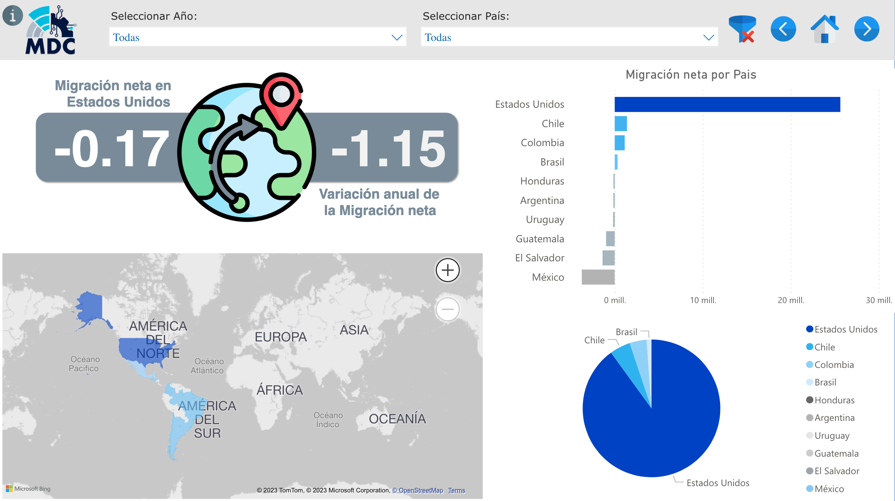
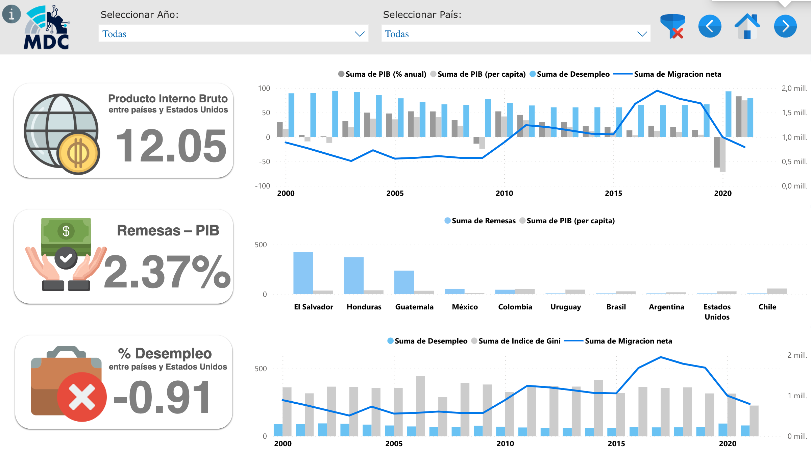

<h1 align="center"> Informe de análisis de datos :bar_chart: 	:mag: </h1>

# Tabla de contenidos
* [Introducción](#Introducción)
* [Proceso preliminar](#Proceso-preliminar)
* [Dashboard](#Dashboard)

# Introducción
El siguiente análisis de los flujos migratorios en Latinoamérica y Estados Unidos es el resultado de las semanas anteriores donde se recopilaron y transformaron datos de gran valor para poder mostrarlos en una visualización que refleje los flujos migratorios en Latinoamérica y Estados Unidos, junto con el análisis de las posibles razones que motivan a las personas amigrar,y cómo influyen en esta decisión los factores económicos y la calidad de vida de las personas en sus países de origen.

En este análisis trabajaremos los siguientes Indicadores clave de Rendimiento (**KPIs**):
1. Variación de la tasa de migración neta en Estados Unidos por año
2. Variación anual de la Migración neta por país
3. Relación del PIB entre países de Latinoamérica y Estados Unidos, por año
4. Diferencia porcentual entre las Remesas y el PIB per cápita por país y año
5. Variación del % de Desempleo entre países de Latinoamérica y Estados Unidos, por año
6. Variación del índice de felicidad entre países y Estados Unidos en el año 2021

Con el presente dashboard nuestra intensión es disponibilizar la información trabajada en este proyecto a nuestros clientes, gobiernos y toda persona que tenga la intención de migrar en Latinoamérica y Estados Unidos.

# Proceso preliminar
Una vez los datos fueron procesados y cargados AWS S3 los conectamos con Power Bi para usar las tablas. Se aplico cierta limpieza a cada tabla para normalizarlas y que su uso fuera más eficiente, quedando los datos divididos en los tablas:
+ datos de migración (datos_migración)
+ datos de calidad de vida (datos_felicidad)

# Dashboard
Para la creación del Dashboard se utilizó el software PowerBI, donde se creó una portada, una página informativa sobre los KPIs abordados en el dashboard y 4 páginas interactivas, enfocadas en los datos de migración, los posibles factores decisivos a la hora de migrar, datos sobre la economía y la calidad de vida.

**_Dashboard Migración:_**
Esta dashboard interactivo muestra la Migración neta (Inmigración - Emigración) en los países estudiados, se puede filtrar la información por país y año; y se muestran los KPIs 1 y 2 que nos ayduan a comprender la variación en la migración de Estados Unidos y de cada país de Latinoamérica.

   
   

**_Dashboard Factor decisivo_**

Esta dashboard resume las principales factores que pueden motivar la migración de un país de origen, como son: _la percepción de la corrupción, la libertad de tomar decisiones vitales y el PIB per cápita_ de cada país.

   
   

**_Dashboard Economía_**
Esta dashboard resume 

   
   

**_Dashboard Calidad de Vida_**
Esta dashboard resume 

   
   

+ Sugerencias
